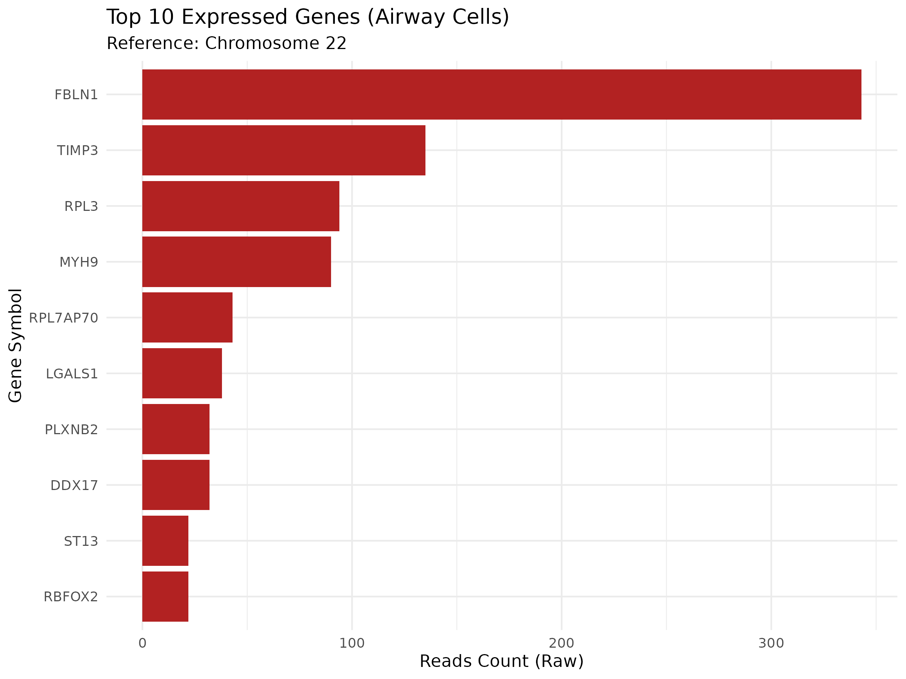

# RNA-Seq Analysis Practice: Control vs Treat (Chr22)

这是一个基于人类气道上皮细胞（Airway Cells）测序数据的转录组分析练习项目。本项目通过对原始测序数据进行质量控制、比对、定量及可视化，完整走通了 RNA-Seq 的上游及初步下游流程。

## 📊 项目概览

* **物种**: *Homo sapiens*
* **测序平台**: Illumina (Paired-end)
* **参考基因组**: GRCh38 (Ensembl Release 111)
* **目标区域**: Chromosome 22 (为了计算效率进行的降维处理)
* **数据量**: 原始数据抽样前 100,000 行

## 📂 目录结构

```text
.
├── data/
│   ├── raw/          # 原始 FASTQ 测序数据
│   └── ref/          # 参考基因组 (FASTA) 及索引 (.ht2)
├── results/          # 核心输出文件 (BAM, Counts, Figures)
├── logs/             # 步骤运行日志 (Alignment rate, QC reports)
├── scripts/          # 全流程 Shell, Python 及 R 脚本
└── README.md         # 项目说明文档

```

## 🛠️ 分析流程 (Pipeline)

### 1. 质量控制 (QC)

使用 `fastp` 对原始双端数据进行去接头、过滤低质量碱基及截取操作。

* **工具**: `fastp`
* **核心输出**: `clean_R1.fastq.gz`, `fastp.html`

### 2. 参考基因组索引构建

针对 22 号染色体构建 HISAT2 索引，优化搜索效率。

* **工具**: `hisat2-build`

### 3. 序列比对 (Mapping)

将 Clean Reads 比对至参考基因组。

* **工具**: `hisat2`, `samtools`
* **关键指标**: 整体比对率约 **4.01%** (符合仅对比 22 号染色体的预期)。
* **产物**: 排序后的 `sample_sorted.bam` 及其索引 `.bai`。

### 4. 表达定量 (Quantification)

统计每个基因区域内落入的 Reads 数量。

* **工具**: `subread (featureCounts)`
* **结果**: 监测到 **153** 个活跃表达基因。

### 5. ID 转换与可视化

利用 Python 进行 Ensembl ID 到 Gene Symbol 的映射，并使用 R 语言进行可视化。

* **工具**: `Python (pandas/re)`, `R (ggplot2)`

## 📈 核心结论

本项目成功识别出 22 号染色体上表达量最高的基因前三位：

1. **FBLN1** (Fibulin-1): 胞外基质蛋白
2. **TIMP3**: 金属蛋白酶抑制因子
3. **RPL3**: 核糖体大亚基蛋白

## 🚀 如何运行

1. 克隆本项目并进入目录。
2. 确保 Conda 环境 `rnaseq` 已激活。
3. 按顺序执行 `scripts/` 目录下的脚本 `01` 至 `06`。

---
### 📊 结果展示

